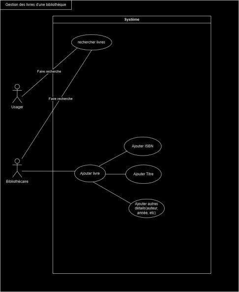
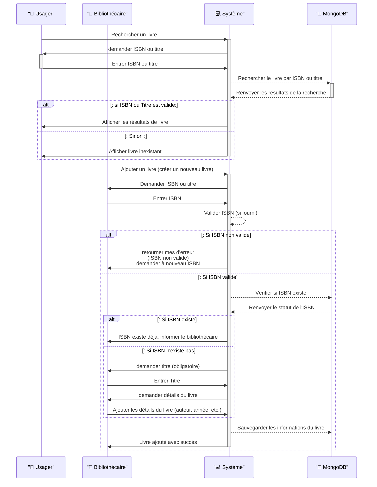

# TP2
## Proposition de Mise à Jour du Système de Gestion de Bibliothèque

## Solution Proposée

### Modifications au Front-end (Vue.js)
1. Interface de Recherche de livres : Ajouter une interface utilisateur permettant aux usagers de rechercher des livres par son ISBN et/ou son titre.
2. Interface d'ajout de livre : Ajouter une interface utilisateur permettant aux bibliothécaires d'entrer les détails du livre, y compris l'ISBN (si disponible) ou le titre.
3.	Validation de l'entrée : Intégrer une validation pour vérifier la présence soit de l'ISBN soit du titre (pour les livres sans ISBN).
   
### Modifications au Back-end (Express.js)
1.	Validation de la recherche : Ajouter une logique pour retourner les résultats de la recherche soit par ISBN ou titre.
2.	Validation de l'ISBN : Ajouter une logique pour valider l'ISBN et vérifier s'il existe déjà dans la base de données MongoDB.
3.	Gestion des livres sans ISBN : Si l'ISBN n'est pas disponible, utiliser le titre comme identifiant unique.
4.	Ajout de livre : Implémenter la fonctionnalité pour insérer les détails du livre dans MongoDB.

### Base de Données (MongoDB)
1.	Modification de la structure de données : Adapter le schéma de la base de données pour gérer les livres y compris ceux sans ISBN.

## Diagramme de cas d'utilisation

## Diagramme de séquence

